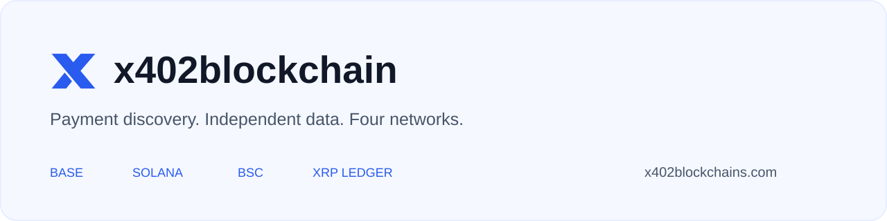

<p align="center"></p>
<p align="center"><a href="https://x402blockchains.com"><strong>Open explorer</strong></a> · <a href="docs/README.md">Documentation</a> · <a href="docs/DISCOVERY.md">Add a project</a> · <a href="docs/FACILITATORS.md">Add a facilitator</a> · <a href="docs/API.md">API reference</a></p>

# x402blockchain

Explore x402 projects, payment services, facilitators, buyers and sellers across **Base, Solana, BSC and XRP Ledger**. The explorer combines public service catalogs with an independent database of indexed blockchain receipts.

The dashboard is live at **[x402blockchains.com](https://x402blockchains.com)**. Collectors run on our hosting independently of website visits. Historical coverage is still partial; this is not a complete copy of x402scan’s database.

## Explore the ecosystem

| Explore | What you can inspect |
| --- | --- |
| [Projects](https://x402blockchains.com/#projects) | Catalog-listed projects, endpoints, networks and payment requirements |
| [Transactions](https://x402blockchains.com/#transactions) | Indexed payments, buyers, sellers, token amounts and chain links |
| [Facilitators](https://x402blockchains.com/#facilitators) | Provider capabilities, documented addresses, source references and activity |
| [Our API](https://x402blockchains.com/#indexers) | Collector progress, errors and coverage |
| [Searchable directory](https://x402blockchains.com/directory/) | HTML project profiles that search engines can discover |

Logos come from provider websites and referenced facilitator metadata. An initials fallback means no usable logo was found. Sample-data previews are explicitly labeled and excluded from real transaction totals.

## Network coverage

| Network | Current payment evidence | Limits |
| --- | --- | --- |
| **Base** | Successful USDC transfers submitted by documented facilitator addresses | Inferred association; known senders and scanned blocks only |
| **Solana** | Finalized SPL Token transfers signed by documented facilitators | Known accounts; original Token program; partial history |
| **BSC** | Finalized settlement events from the published x402-exec router | That router only; other payment paths need adapters |
| **XRP Ledger** | Validated successful payments carrying T54’s documented SourceTag | Tags are public signals, not proof of identity |

Token amounts are shown in token units. Addresses are not unique people. Catalog entries are provider-reported, and ordinary transfers are not automatically classified as x402. [Read the coverage guide →](docs/COVERAGE.md)

## Run locally

Use **Node.js 24+** and **pnpm 11.25.0**, as pinned in `package.json`.

```sh
git clone https://github.com/X402blockchains/x402blockchain.git
cd x402blockchain
pnpm install --frozen-lockfile
pnpm test
pnpm dev
```

Open **http://127.0.0.1:4173**. Repository access is required while the repository is private. The local preview uses `.local/development.sqlite` and does not grant administrator access.

### Run your own collector

```sh
cp .env.example .env
pnpm build
node --env-file=.env scripts/collector.mjs
```

The collector serves read-only APIs at **http://127.0.0.1:4174**, stores receipts in SQLite and resumes from durable checkpoints. Public RPC providers can be used initially; their limits and retained history affect speed and completeness. No wallet or private key is needed.

For production, use persistent storage, a process supervisor or scheduled batches, backups and an HTTPS reverse proxy. [Self-hosting](docs/SELF_HOSTING.md) · [Operations](docs/OPERATIONS.md)

## API example

```sh
curl 'https://x402blockchains.com/api/v1/transactions?network=Base&days=1&page=1&limit=20'
```

Read APIs cover transactions, analytics, projects, services, facilitators, participants, addresses and collector health. `days=0` means all retained history, not every transaction ever made. [API guide](docs/API.md) · [Live OpenAPI](https://x402blockchains.com/api/openapi.json)

## Add your project or facilitator

- **Project owners:** publish HTTPS endpoints with x402 payment requirements, a project description, network information and an official logo. Follow [project discovery](docs/DISCOVERY.md).
- **Facilitator operators:** supply a capability endpoint, documented signer addresses and settlement evidence. Follow [facilitator onboarding](docs/FACILITATORS.md).
- **Contributors:** use the issue and pull-request templates, preserve evidence labels and include relevant validation. See [CONTRIBUTING.md](CONTRIBUTING.md).

The public custom-domain collector currently rejects write requests. Its website submission form is not a working public write service on that deployment. Until a submission backend is connected, use a repository issue or pull request if you have access. Hosted identity-enabled deployments support a separate review workflow.

## Repository map

```text
public/       Dashboard, logos and generated search pages
server/       Read APIs, discovery sources and chain adapters
scripts/      Development server, build, collector and catalog tools
db/           Database schema
drizzle/      Database migrations
tests/        API, indexing and validation tests
docs/         API, onboarding, hosting and coverage guides
examples/     Receipt-integration example
branding/     Project logo and repository artwork
```

[Architecture](docs/ARCHITECTURE.md) explains how discovery, indexing and the API connect. [Documentation index](docs/README.md) links every contributor guide.

## Current priorities

- Improve backfill throughput and monitoring across the four supported networks.
- Add documented payment adapters and expand source coverage.
- Connect an authenticated public project-submission workflow.
- Improve logo availability and project attribution.

## Security and attribution

Never commit RPC credentials, wallet keys, customer contacts or local databases. See [SECURITY.md](SECURITY.md). Preserve upstream attribution in [THIRD_PARTY_NOTICES.md](THIRD_PARTY_NOTICES.md).

This is an independent project and is not affiliated with x402scan or its maintainers. Third-party components retain their own licenses; this repository does not currently grant an open-source license for project-owned code.
