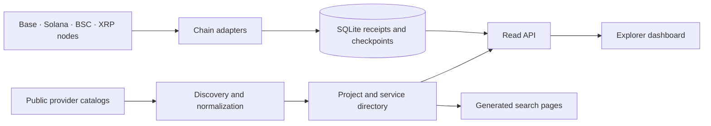

# Architecture

## Two distinct data paths

Discovery reads provider catalogs and groups endpoints by website origin. `server/sources.mjs` defines providers; `server/direct-resources.mjs` holds directly checked merchant entries. Catalog presence does not establish transaction volume.

Collection reads supported blockchain evidence. Adapters validate records and store receipts, evidence and durable progress. Database keys prevent duplicate receipt insertion. Base and BSC have separate historical and recent cursors; Solana rotates documented accounts; XRP follows validated ledgers.

`server/backend.mjs` exposes the read API. `public/app.js` renders real API results. The explicitly labeled X Pay design preview uses frontend-only examples; it does not insert records into storage.

## Runtime choices

The custom-domain deployment uses a read-only Node API with SQLite and scheduled collection. The default standalone collector can serve the frontend and run collection in one process. Separate read-only serving and scheduled collection are supported by `--serve` and `--collect-only`.

The optional Sites runtime uses D1 and hosted identity. Its storage is separate from SQLite. A configured collector URL can relay payment reads; GitHub commits do not automatically deploy either runtime.

## Coverage and reliability

A public node can throttle requests or lack historical data. Failed batches must not advance beyond unprocessed records. A provider address or public source tag is an association signal, not proof of the purchased HTTP resource. See [coverage](COVERAGE.md) before interpreting totals.
